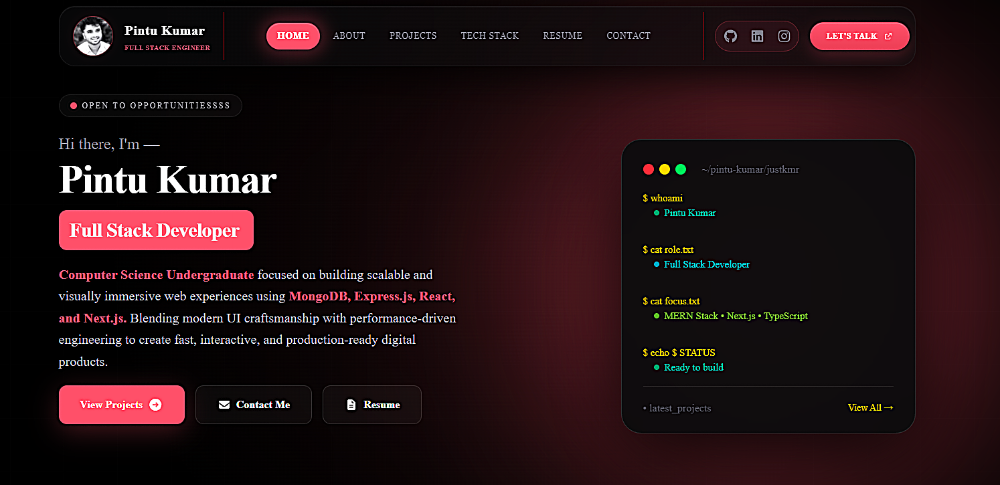
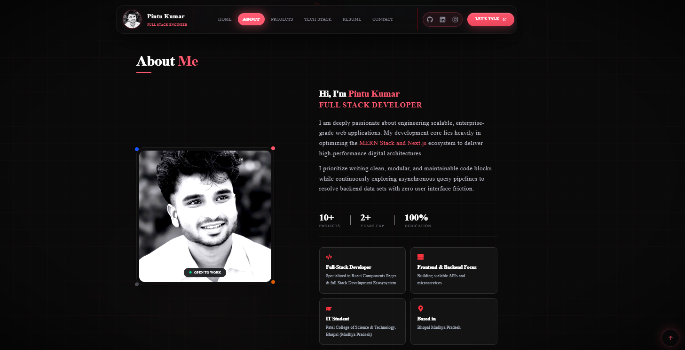
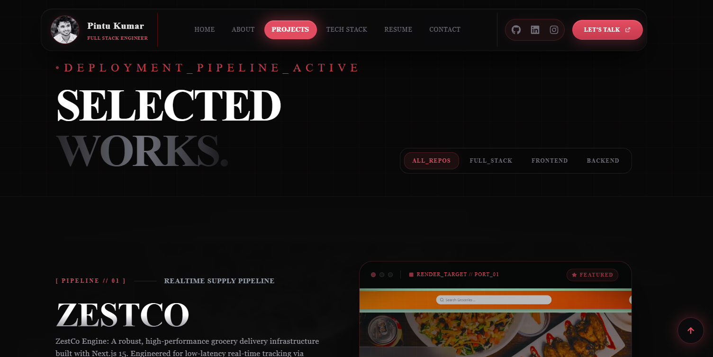
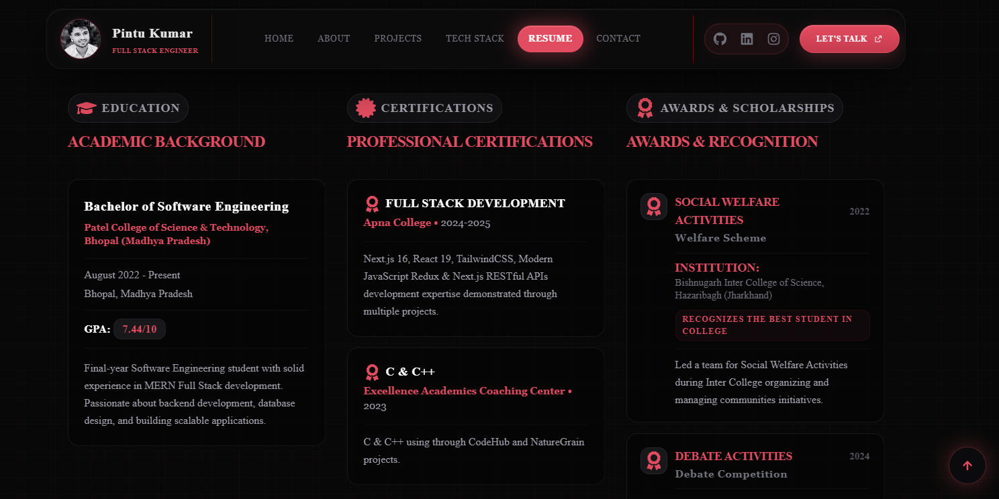
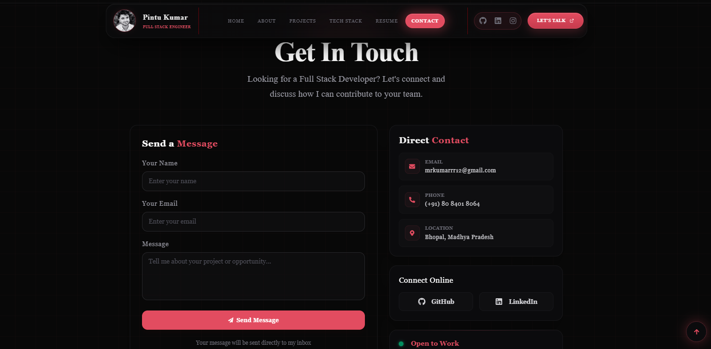
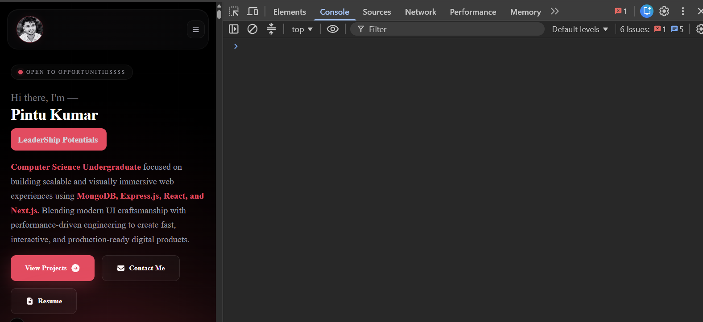

# 🌌 Paradox | Modern Interactive Personal Paradox

<p align="center">
  
</p>

<h1 align="center">🚀 Pintu KumarrR Paradox</h1>

<p align="center">
  <strong>A Modern, Interactive & Performance-Optimized Personal Paradox</strong>
</p>

<p align="center">
  
  
  
  
</p>

<p align="center">
  
  
  
  
</p>

<p align="center">
  <a href="#overview">🌐 Live Demo</a> •
  <a href="#features">✨ Features</a> •
  <a href="#tech-stack">🛠️ Tech Stack</a> •
  <a href="#getting-started">🚀 Get Started</a>
</p>


---


## 📋 Table of Contents

* [Overview](#-overview)
* [Features](#-features)
* [Tech Stack](#-tech-stack)
* [Screenshots](#-screenshots)
* [Project Structure](#-project-structure)
* [Getting Started](#-getting-started)
* [Available Scripts](#-available-scripts)
* [Deployment](#-deployment)
* [Contributing](#-contributing)
* [License](#-license)
* [Contact](#-contact)

---

## 🎯 Overview

Welcome to my **Personal Developer Paradox** — a meticulously crafted website that showcases my journey, skills, and projects as a **Full Stack Developer**. This exhibition is more than just a resume; it's an interactive experience built with cutting-edge web technologies.

| Property | Specification |
| :--- | :--- |
| ⚡ **Lightning Fast** | Powered by Next.js 15 and Turbopack with optimized bundle splitting and lazy loading |
| 📱 **Fully Responsive** | Pixel-perfect fluid responsive design from mobile devices to ultra-wide screens |
| 🎨 **Stunning Animations** | Smooth transitions powered by Framer Motion layouts with custom cubic-bezier curves |
| 🔒 **Secure Contact** | Integrated serverless mail stream powered securely via Web3Forms API framework |
| ♿ **Accessible** | WCAG compliant with semantic HTML structures and keyboard navigation support |

---

## ✨ Features

### 🎨 Design & User Experience
| Feature | Description |
| :--- | :--- |
| **🌐 Dynamic Grid Matrix** | Active background layout engine rendering responsive matrix overlays seamlessly |
| **✨ Intersection Snapping** | Custom observer sync scripts to trigger active states directly inside the Navbar |
| **🎨 Active Pill Transitions** | Fluid spring layout micro-interactions moving anchors smoothly on hover states |
| **📱 Mobile Responsive Menu** | Custom responsive slide-out menu layout matching device viewpoints |

### ⚙️ Functional Components
| Component | Description |
| :--- | :--- |
| **📄 PDF Resume Streamer** | Asynchronous network stream engine fetching binary compilation sheets on demand |
| **📡 Contact Core Engine** | Secure lead generation console executing client-side fetch payloads directly to inbox |
| **⏱️ Interface Clear Scripts** | Automatic runtime trackers wiping warning or success alert boxes exactly after 4s |
| **📜 Mapped Config Data** | Decoupled atomic structure storing dynamic project lists inside typed object layers |
| **⚖️ Embedded MIT System** | Inline legal registry dashboard block mapping standard open source usage parameters |

### 🚀 Performance & SEO
| Feature | Description |
| :--- | :--- |
| **⚡ Chunk Splitting** | On-demand component rendering leveraging Next.js local chunk slicing |
| **🖼️ Optimized Asset Pipeline** | Responsive image compression utilizing structural layout specifications |
| **🔍 Semantic SEO Indexing** | Deep search index integration utilizing optimized header metadata tokens |

---
## 🛠️ Tech Stack

### Core Technologies
* **React 19** — Component-driven core single-viewport layer architecture
* **Next.js 15 (App Router)** — Dynamic serverless compilation framework routing
* **TypeScript** — Strict static type boundaries and compile-time data matrices

### Animation & UI
* **Tailwind CSS** — Declarative layout systems and keyframe utilities
* **Framer Motion** — Strict tuple-driven physics ease curves (`[0.25, 1, 0.5, 1] as const`)

### Tools & Hosting
* **Web3Forms API** — External secure contact endpoint configuration
* **Vercel Ecosystem** — Automated continuous integration deployment pipeline

---

<details>
<summary>📦 <strong>Full Dependencies List</strong></summary>

| Package | Version | Description |
| :--- | :--- | :--- |
| `react` | `^19.0.0` | UI Library |
| `react-dom` | `^19.0.0` | React DOM renderer |
| `next` | `^15.0.0` | Core Framework Routing Shell Engine |
| `framer-motion` | `^12.9.2` | Advanced Physics Animation Library |
| `tailwindcss` | `^4.1.8` | Utility-First Responsive CSS Framework |
| `react-icons` | `^5.5.0` | Comprehensive System Icon Library |
| `react-pdf` | `^9.2.1` | PDF viewer |
| `react-github-calendar` | `^4.5.6` | GitHub contributions |
| `web3Forms` |  `Web3Forms Docs v2 Engine` | Email service |

</details>

---
## 📸 Screenshots

### 🏠 Home Page
<p align="center">
  
</p>

### 👨‍💻 About Section
<p align="center">
  
</p>

### 🎨 Projects Gallery
<p align="center">
  
</p>

### 📄 Resume Section
<p align="center">
  
</p>

### ✉️ Contact Section
<p align="center">
  
</p>

### 📱 Mobile Responsive
<p align="center">
  
</p>


---

## 📂 Project Structure

```text
paradox/
├── .next/                      # Next.js native build optimization artifacts
├── node_modules/               # Local module dependency compilation tree
├── public/                     # Static Asset Pipeline (Directly exposed to server side)
│   ├── documents/              # System document repository (e.g., kumarrR.pdf)
│   ├── projects/               # Visual asset inventory mapping project thumbnail images
│   ├── testimonials/           # Peer validation and client profile image assets
│   ├── file.svg                # System utility layout vectors
│   ├── globe.svg               
│   ├── next.svg                
│   ├── paradox.png             
│   ├── Sajan.jpeg              # High-fidelity root brand profile image asset
│   ├── vercel.svg              
│   └── window.svg              
├── src/                        # Core Application Source Matrix
│   ├── app/                    # Next.js App Router Core Layer Config
│   │   ├── globals.css         # Baseline style variables and global animation utilities
│   │   ├── icon.png            # Application browser window shortcut target
│   │   ├── layout.tsx          # Root orchestration bundle containing HTML framing shell
│   │   ├── page.tsx            # Main single-viewport tree entry platform index controller
│   │   └── template.tsx        # Mount transition framework tracking path changes smoothly
│   ├── components/             # Reusable Visual Framework Architecture Nodes
│   │   ├── ecosystem/          # Integrated platform widgets
│   │   │   ├── github/         # Real-time Git portfolio matrix configuration
│   │   │   │   ├── GithubCard.tsx   
│   │   │   │   ├── GithubGrid.tsx   
│   │   │   │   ├── GithubMain.tsx   
│   │   │   │   └── index.ts    # Re-export gateway mapping modular elements
│   │   │   └── testimonials/   # Peer validation UI blocks layout
│   │   │       └── Testimonials.tsx 
│   │   ├── loaders/            # Initialization layout elements
│   │   │   └── Preloader.tsx   # Fluid layout screen initialization widget
│   │   ├── Magnetic/           # Dynamic mouse vector friction physics module
│   │   │   └── index.tsx       
│   │   ├── providers/          # Global environmental runtime contexts
│   │   │   ├── ClientWrapper.tsx # Client-side runtime guard wrapper
│   │   │   └── theme-provider.tsx # Theme application configuration tracking state
│   │   ├── sections/           # Modular viewport section bundles
│   │   │   ├── About.tsx       # Core resume summary layout node
│   │   │   ├── Contact.tsx     # Lead form with 4s automated message wipe triggers
│   │   │   ├── Footer.tsx      # Terminal-style application footer segment
│   │   │   ├── Hero.tsx        # High-impact immediate viewport interaction scene
│   │   │   ├── Navbar.tsx      # Floating sticky context-aware route anchor tracker
│   │   │   ├── Projects.tsx    # Responsive client project filtering system block
│   │   │   ├── Resume.tsx      # Async file tracking terminal log layout grid
│   │   │   ├── TechMarquee.tsx # Hardware-accelerated dynamic badge ticker
│   │   │   └── TechStack.tsx   # Technical proficiency grid array module
│   │   ├── SmoothScroll/       # Lenis/Custom mechanical touch normalization layers
│   │   │   └── index.tsx       
│   │   └── ui/                 # Atomic token layout primitives
│   │       ├── button.tsx      # Reusable custom interactive component layout element
│   │       └── ScrollToTop.tsx # Global scroll window floating utility widget
│   ├── data/                   # Decoupled structural data models
│   │   ├── projects.ts         # Strictly typed project dataset mapping matrices
│   │   └── techstack.ts        # Skills array object lists mapped cleanly straight into components
│   ├── hooks/                  # Custom React reactive event wrappers
│   │   └── useReveal.ts        # Automated scroll-triggered component emergence tracker
│   └── lib/                    # Core pipeline utilities configurations
│       └── utils.ts            # High-efficiency className merge handler (clsx + tailwind-merge)
├── .env.local                  # Environment storage isolation locker tracking public API tokens safely
├── .gitignore                  # Explicit instructions ignoring standard system tracking lists
├── AGENTS.md                   # Machine coordination workflow configurations logs
├── CLAUDE.md                   # Core code styling parameters enforcement system definitions
├── components.json             # Atomic design configuration presets tracking layers
├── eslint.config.mjs           # Quality syntax lint validation and verification matrices
├── LICENSE                     # MIT Open Source validation legal parameters mapping file
├── next-env.d.ts               # Standard Next.js ambient internal typing engine overrides
├── next.config.ts              # Server compilation presets and router engine properties setup
├── package-lock.json           # Secure structural lock configuration sheet mapping module validation hashes
├── package.json                # Primary manifest defining architecture execution rulesets
├── postcss.config.mjs          # PostCSS transformations integration script handling utility formatting
├── README.md                   # High-level architecture documentation console tracking files
└── tsconfig.json               # Absolute compilation tracking presets enforcing strict static types
```
---

## 🚀 Getting Started

### Prerequisites

Before you begin, ensure you have the following installed:

- **Node.js** `v18.0.0` or higher
- **npm** `v9.0.0` or higher (or **yarn** / **pnpm**)

### Installation

1️⃣ **Clone the repository**

```bash
git clone 
```

2️⃣ **Navigate to project directory**

```bash
cd paradox
```

3️⃣ **Install dependencies**

```bash
npm install
# or
yarn install
# or
pnpm install
```

4️⃣ **Start development server**

```bash
npm run dev
```

5️⃣ **Open in browser**

```
http://localhost:3000
```

## 📜 Available Scripts

| Script | Command | Description |
|--------|---------|-------------|
| 🔧 **Dev** | `npm run dev` | Start development server with HMR |
| 🏗️ **Build** | `npm run build` | Create production build |
| 👁️ **Preview** | `npm run preview` | Preview production build locally |
| 🔍 **Lint** | `npm run lint` | Run ESLint and auto-fix issues |
| 🧹 **Clean** | `npm run clean` | Remove dist and cache folders |
| 📦 **Build Prod** | `npm run build:prod` | Clean + Production build |

---


## 🌐 Deployment

This exhibition is configured for seamless deployment on **Vercel**:

[](https://vercel.com/new/clone?repository-url=https://github.com/)

### Manual Deployment

```bash
# Build for production
npm run build

# Preview build locally
npm run preview
```

The `dist/` folder contains the production-ready files.

---

## 🤝 Contributing

Contributions make the open-source community amazing! Any contributions are **greatly appreciated**.

1. **Fork** the Project

2. **Create** your Feature Branch
   ```bash
   git checkout -b feature/AmazingFeature
   ```
3. **Commit** your Changes
   ```bash
   git commit -m '✨ Add some AmazingFeature'
   ```
4. **Push** to the Branch
   ```bash
   git push origin feature/AmazingFeature
   ```
5. **Open** a Pull Request

---

## 📄 License

This project is licensed under the **MIT License** - see the [LICENSE](LICENSE) file for details.

```
MIT License

Copyright (c) 2026 Pintu Kumar (Mr. KumarrR)

Permission is hereby granted, free of charge, to any person obtaining a copy
of this software and associated documentation files (the "Software"), to deal
in the Software without restriction, including without limitation the rights
to use, copy, modify, merge, publish, distribute, sublicense, and/or sell
copies of the Software, and to permit persons to whom the Software is
furnished to do so, subject to the following conditions:

The above copyright notice and this permission notice shall be included in all
copies or substantial portions of the Software.

THE SOFTWARE IS PROVIDED "AS IS", WITHOUT WARRANTY OF ANY KIND, EXPRESS OR
IMPLIED, INCLUDING BUT NOT LIMITED TO THE WARRANTIES OF MERCHANTABILITY,
FITNESS FOR A PARTICULAR PURPOSE AND NONINFRINGEMENT. IN NO EVENT SHALL THE
AUTHORS OR COPYRIGHT HOLDERS BE LIABLE FOR ANY CLAIM, DAMAGES OR OTHER
LIABILITY, WHETHER IN AN ACTION OF CONTRACT, TORT OR OTHERWISE, ARISING FROM,
OUT OF OR IN CONNECTION WITH THE SOFTWARE OR THE USE OR OTHER DEALINGS IN THE
SOFTWARE.
```
---

## 📞 Contact

<div align="center">

### *Pintu Kumar* — Full Stack Developer

<p>
  <a href="https://github.com/justkmr">
    
  </a>
  <a href="https://www.linkedin.com/in/pintu-kumar-12x">
    
  </a>
  <a href="mailto:mrkumarrr12@gmail.com">
    
  </a>
  
</p>

<br />

*🌟 If you found this project helpful, please give it a star!*


</div>

---

<div align="center">
  <sub>Built with ❤️ and ☕ by <a href="https://github.com/justkmr">Pintu Kumar</a></sub>
  <br />
  <sub>© 2026 All Rights Reserved</sub>
</div>